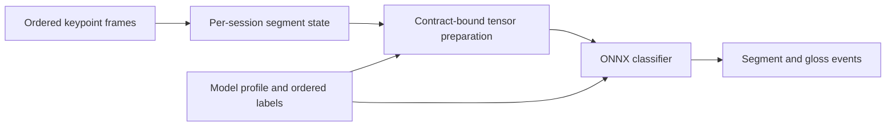

# VSL Streaming Toolkit

[](https://github.com/ntthienphuc/vsl-streaming-toolkit/actions/workflows/ci.yml)
[](LICENSE.txt)
[](https://github.com/ntthienphuc/vsl-streaming-toolkit/releases)

**Version 0.1.1** — Python library, CLI and self-hosted WebSocket server.

A Python library and configurable WebSocket server for connecting a compatible
keypoint sequence classifier to an application:

**Ordered keypoints → segments → model tensor → ONNX logits → gloss events.**

The toolkit owns buffering, motion/window segmentation, per-connection state,
frame ordering, retry handling, model-contract checks and deployment commands.
Developers supply a trained classifier, its exact preprocessing contract and
ordered labels. The existing Android app can be adapted to this protocol;
a browser frame-file replay page and Python WebSocket client are included.

Copyright © 2026 Nguyễn Trần Thiên Phúc. Toolkit source is released under
[MIT](LICENSE.txt). Dependencies retain their own licenses; see
[THIRD_PARTY_NOTICES.md](THIRD_PARTY_NOTICES.md). No trained sign-language model,
recorded keypoints, or training dataset is distributed. The runnable demo uses
a generated synthetic model and establishes execution, not recognition accuracy.



## Install and run the complete demonstration

Use Python 3.9 or later. Clone the public release and create an isolated environment:

```powershell
git clone https://github.com/ntthienphuc/vsl-streaming-toolkit.git
cd vsl-streaming-toolkit
python -m venv .venv
.\.venv\Scripts\python.exe -m pip install ".[server,export]"
.\.venv\Scripts\vsl-stream.exe demo --out my_demo
.\.venv\Scripts\vsl-stream.exe serve --bundle my_demo/bundle --config my_demo/server.json
```

On Linux/macOS use `.venv/bin/python` and `.venv/bin/vsl-stream` instead.
For a CPU-only PyTorch installation, install `torch==2.8.0` from
`https://download.pytorch.org/whl/cpu` before the export extras.
The package is available from this repository and GitHub release assets;
a PyPI publication is not assumed.

Open `http://127.0.0.1:8000/`, choose `my_demo/frames.json`, and click **Replay
file**. The two expected outputs are `SYNTHETIC_NEGATIVE` and
`SYNTHETIC_POSITIVE`. They are synthetic fixture labels. The demo saves
weights, ONNX bundle, profile, settings and an execution receipt in `my_demo`.
It refuses to overwrite an existing directory.

From another terminal, a programmatic client can replay the same stream:

```powershell
.\.venv\Scripts\python.exe examples/websocket_client.py --frames my_demo/frames.json
```

An inference-only server needs `pip install ".[server]"`; PyTorch is only
required for export/demo. Model registration/checking is included in the base
installation. `requirements-tested.txt` identifies tested direct versions;
it is not a platform-independent transitive lockfile.

## Bring a trained model

1. Create editable files with `vsl-stream init --out my_model_config`.
2. Replace `labels.json` with the **training class order**. Edit `profile.json`
   to describe the training input names, layout, dimensions and preprocessing.
3. Provide an importable factory that returns the actual PyTorch architecture.
   A wrapper may adapt the model's output to one raw-logit tensor `[1, classes]`.
4. Export the weights-only state dictionary, or register an existing ONNX file.
5. Inspect the bundle, then start the server with suitable segmentation settings.

```powershell
vsl-stream export --factory my_package.models:build_model --checkpoint weights.pt --labels my_model_config/labels.json --profile my_model_config/profile.json --model-kwargs-file my_model_config/model_kwargs.json --out my_bundle
vsl-stream inspect --bundle my_bundle
vsl-stream serve --bundle my_bundle --config my_model_config/server.json
```

For an already exported single-file ONNX graph:

```powershell
vsl-stream register --model model.onnx --labels labels.json --profile profile.json --out my_bundle
```

A custom factory must be installed or its parent directory made importable with
`PYTHONPATH`; the example factory modules live in the source checkout. Edit
`model_kwargs.json` to match the constructor and training class count.
A bare checkpoint cannot reveal its architecture, landmark order or
normalization. Those must be supplied. V1 accepts one float32 keypoint tensor,
with `BTVC` or `BCTVM` layout, and a float32 raw-logit output `[1, classes]`.
CTC recognizers, video CNN inputs, multi-input models and text translation need
additional explicit adapters. The new `mediapipe49-shoulder-v1` profile must
match training; it is not compatible by assumption with legacy SPOTER/SL-GCN
weights. Use `identity-v1` when the client supplies already prepared per-frame
model points. A trusted `external-python-v1` function can preserve an existing
model's full preparation pipeline; its declared source files are hash checked.
See [MODEL_CONTRACT.md](docs/MODEL_CONTRACT.md).

An exported bundle contains `model.onnx`, `profile.json`, `labels.json`, and
`manifest.json`. SHA-256 checks bind the graph, configuration and ordered labels
against accidental edits. Executable shape/class/finite-output checks run
before serving. Hashes are not signatures and cannot prove that the author
declared the correct training semantics.

## Python library use

```python
from vsl_streaming import StreamConfig, StreamSession
from vsl_streaming.runtime import ONNXRecognizer

recognizer = ONNXRecognizer("my_bundle")
session = StreamSession(StreamConfig(mode="fixed_window", window_frames=60))
for segment in session.push_batch(frames):
    print(segment.to_dict(include_frames=False), recognizer.predict_segment(segment.frames))
for segment in session.flush():
    print(recognizer.predict_segment(segment.frames))
```

Each frame requires `seq` and `timestamp_ms`; both increase strictly. In
fixed-window identity mode, it also contains `points` shaped `[points,channels]`.
Signing-space segmentation uses `pose_landmarks` (33), `left_hand_landmarks`
(21), and `right_hand_landmarks` (21), with finite `x,y,z,visibility` values.
Missing pose is inactive. Missing/invalid pose inside an emitted segment may
cause the selected model preprocessor to reject that segment explicitly.

See [SEGMENTATION.md](docs/SEGMENTATION.md) for exact geometry, dropout, gap,
capacity, minimum-length, flush and discarded-frame behavior. The heuristic is
not a validated general boundary detector for continuous sign language.

## WebSocket protocol and configuration

Connect to `/v1/stream`, receive a `ready` message, then send:

```json
{"type":"frames","request_id":"capture-1","frames":[{"seq":0,"timestamp_ms":0,"points":[[0.1,0.2],[0.3,0.4]]}],"flush":false}
```

The points dimensions must match the loaded bundle; the illustration above is
not the 49-point default. Commands `flush`, `reset`, and `status` contain only
`type` and `request_id`. Every response identifies the request and contains all
completed segment events or an explicit error. `frames` with `flush:true`
appends/validates that batch first, then closes pending work.

Each connection owns its state. A new connection starts fresh; disconnect drops
unfinished work. Recent exact retries return cached results without rerunning
inference. Reusing an ID with changed content is rejected. Cache expiry and
disconnect end the retry guarantee; this is not durable exactly-once delivery.
Frame-validation errors reject the full batch without advancing the session.
At the configured transport byte limit, Uvicorn may close an oversized
WebSocket message with code 1009 before an application JSON error is possible.
Segment-inference errors report rejected events after segmentation; they do not
roll back the accepted stream. No errors are silently relabeled as successful.

`server.json` configures segmentation, provider, top-k, session capacity, batch
and byte limits, retry cache size and inference concurrency. Unknown settings
are rejected. `/health` and `/v1/config` expose readiness and the public contract.
One outstanding acknowledged message per client bounds pending application
work. The server runs one process with bounded session buffers; it needs no
Redis. Shared state, worker migration and reconnect continuation are outside
this version's contract. Softmax `confidence` is an uncalibrated class score.

The default bind is loopback for local testing. A network deployment should use
the organization's normal reverse proxy/access controls. An external camera or
MediaPipe extractor belongs in a client adapter; the included browser example
replays keypoint files.

## Replay and development verification

```powershell
vsl-stream replay --bundle my_bundle --frames frames.json --config server.json --batch-size 5 --receipt replay_receipt.json
python -m unittest discover -s tests -v
python -m build
```

Representative export inputs can be checked with `export --validation-tensors
real_inputs.npz`; the NPZ contains `inputs` with N float32 preprocessed samples.
The export receipt records their hash and numerical/class agreement. The default
three synthetic probes alone establish only an export smoke check.

For a self-contained verification procedure, see [REPRODUCE.md](REPRODUCE.md).
The included `Start-Demo.ps1` prepares and serves the synthetic example on Windows.

Replay uses the same core and runtime as the WebSocket adapter. The receipt
records settings, model hash, events, explicit failures and processing times.
Frame replay is useful with experimentally recorded keypoints, but replay
alone is not a live-camera experiment. Tests cover ordering, batch atomicity,
multiple segments, fragmentation, gaps, dropout, flush/reset, bounded state,
bundle tampering, export parity, sessions, retries and malformed messages.

The optional Dockerfile installs the server extras and accepts mounted model
and config directories. See [DEPLOYMENT.md](docs/DEPLOYMENT.md) for commands.
CI includes a synthetic CPU container check. Jetson compatibility and target
latency require separate target checks.

## Research and release preparation

[RELATED_WORK.md](docs/RELATED_WORK.md) compares OpenHands, SignON, signBridge,
SLRT Online and adjacent tools. Streaming sign apps and reusable SLR libraries
already exist. The proposed contribution is a reusable model/keypoint contract,
specified segment-event lifecycle, verified onboarding and reproducible
evaluation, supported by evidence from real models and recorded streams.

[VALIDATION.md](docs/VALIDATION.md) separates reproducible public checks from
private integration evidence and outstanding research experiments. This release
does not claim independently validated sign-recognition accuracy, general
continuous-language segmentation, Jetson performance, or acceptance by a journal.

## Project layout and citation

| Path | Purpose |
| --- | --- |
| `src/vsl_streaming/` | Segmentation, protocol, configuration, bundles and runtime |
| `examples/` | Python client, model factory and optional owner-code bridge |
| `tests/` | Core, malformed-input, adapter, bundle and server checks |
| `tools/verify_websocket_install.py` | Installed-package TCP/replay comparison |
| `docs/` | Model contract, segment lifecycle, validation and related work |
| `.github/workflows/ci.yml` | Tests, export fixture, wheel and TCP checks |

Use [CITATION.cff](CITATION.cff) to cite this software version. Bug reports and
model-integration questions belong in [GitHub Issues](https://github.com/ntthienphuc/vsl-streaming-toolkit/issues).
See [CONTRIBUTING.md](CONTRIBUTING.md) and [CHANGELOG.md](CHANGELOG.md).
