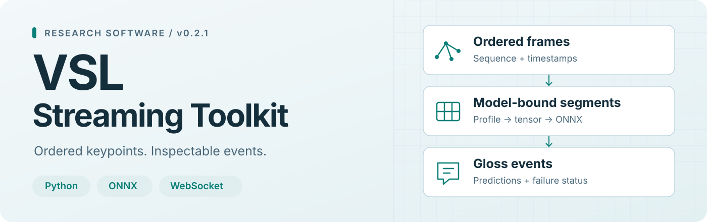

<picture>
  <source media="(prefers-color-scheme: dark)" srcset="docs/assets/readme-banner-dark.svg">
  
</picture>

<h1 align="center">VSL Streaming Toolkit</h1>

  Reproducible deployment of keypoint-based, isolated-sign classifiers. 
  <strong>Python library · CLI · WebSocket service · Capture and replay adapters</strong>

  
  
  
  

  <a href="#quick-start">Quick start</a> ·
  <a href="#use-your-own-model">Model integration</a> ·
  <a href="#capture-replay-and-evaluate">Capture &amp; evaluation</a> ·
  <a href="#documentation">Documentation</a> ·
  <a href="#validation-and-research-scope">Validation</a>

---

Connect a compatible trained classifier to an ordered keypoint stream, then
inspect the segments, predictions and failures it produces. The toolkit manages
buffering, segmentation, model-input checks and per-connection state. You supply
the model, its preprocessing contract and labels in training class order.

**Ordered frames → segments → profile-specific tensors → ONNX → gloss events**

| Your task | Start here |
| --- | --- |
| Try the complete public workflow | [Run the synthetic demo](#quick-start) |
| Connect a trained classifier | [Create and inspect a model bundle](#use-your-own-model) |
| Capture or replay a stream | [Desktop and Android adapters](#capture-replay-and-evaluate) |
| Reproduce the software checks | [REPRODUCE.md](REPRODUCE.md) |

> **Research scope:** outputs are segment-level gloss predictions. The public demo
> is synthetic. Natural-sign accuracy, linguistic boundaries and physical-device
> performance need separate experiments; see [evidence and limits](docs/EVALUATION_SCOPE.md).

## Quick start

Use **Python 3.11** for the illustrated environment. The core/server supports
Python 3.9+. Installation is from this repository or the [release assets](https://github.com/ntthienphuc/vsl-streaming-toolkit/releases/tag/v0.2.1).

<strong>Windows · PowerShell</strong>

~~~powershell
git clone https://github.com/ntthienphuc/vsl-streaming-toolkit.git
cd vsl-streaming-toolkit
git checkout v0.2.1
python -m venv .venv
.\.venv\Scripts\python.exe -m pip install --upgrade pip
.\.venv\Scripts\python.exe -m pip install torch==2.8.0 --index-url https://download.pytorch.org/whl/cpu
.\.venv\Scripts\python.exe -m pip install ".[server,export]"
.\.venv\Scripts\vsl-stream.exe demo --out my_demo
.\.venv\Scripts\vsl-stream.exe serve --bundle my_demo/bundle --config my_demo/server.json
~~~

<strong>Linux · shell</strong>

~~~sh
git clone https://github.com/ntthienphuc/vsl-streaming-toolkit.git
cd vsl-streaming-toolkit
git checkout v0.2.1
python3 -m venv .venv
.venv/bin/python -m pip install --upgrade pip
.venv/bin/python -m pip install torch==2.8.0 --index-url https://download.pytorch.org/whl/cpu
.venv/bin/python -m pip install ".[server,export]"
.venv/bin/vsl-stream demo --out my_demo
.venv/bin/vsl-stream serve --bundle my_demo/bundle --config my_demo/server.json
~~~

<strong>macOS · shell</strong>

~~~sh
git clone https://github.com/ntthienphuc/vsl-streaming-toolkit.git
cd vsl-streaming-toolkit
git checkout v0.2.1
python3 -m venv .venv
.venv/bin/python -m pip install --upgrade pip
.venv/bin/python -m pip install torch==2.8.0
.venv/bin/python -m pip install ".[server,export]"
.venv/bin/vsl-stream demo --out my_demo
.venv/bin/vsl-stream serve --bundle my_demo/bundle --config my_demo/server.json
~~~

The macOS path uses the standard PyTorch wheel index. Public release CI covers
Linux and Windows; macOS instructions are not a recorded platform validation.

**Open [localhost:8000](http://127.0.0.1:8000/)** → choose
<code>my_demo/frames.json</code> → click **Replay file**.

Expected labels: <code>SYNTHETIC_NEGATIVE</code>, then <code>SYNTHETIC_POSITIVE</code>.
The generated bundle, frames, configuration and receipt stay in <code>my_demo/</code>.
Choose a new output directory on each run; the demo refuses to overwrite one.

The complete demo needs PyTorch for model export. An inference-only installation
uses <code>python -m pip install ".[server]"</code> and an existing compatible bundle.
The [Windows launcher](Start-Demo.ps1) and [reproduction guide](REPRODUCE.md) provide
the longer verification path.

## What is included

| Component | What it provides |
| --- | --- |
| **Library &amp; server** | Ordered streams, bounded segmentation, ONNX inference and connection-owned state |
| **Model onboarding** | Editable profiles and labels, export/import, artifact hashes and executable checks |
| **Native profiles** | Audited SPOTER-54 legacy and SL-GCN-27 bone input preparation |
| **Capture adapters** | Optional desktop video extraction and an Android camera/file-replay reference client |
| **Replay &amp; evaluation** | Offline receipts, temporal event matching, missed/extra intervals and gloss edit counts |
| **Session evidence** | Opt-in server response logs with model/configuration identity and terminal state |

The included browser replays keypoint files. Desktop and Android capture use
separate optional adapters and separately obtained detector assets.

## Use your own model

1. Create editable configuration with <code>vsl-stream init --out my_model_config</code>.
2. Set labels in **training class order** and make the profile match the training
   tensor, landmark order, temporal sampling and preprocessing.
3. Export a trusted PyTorch architecture/checkpoint, or register a single-file ONNX graph.
4. Inspect the bundle, then serve it with the generated configuration.

The commands below assume an **activated virtual environment**. On PowerShell,
use <code>.\.venv\Scripts\Activate.ps1</code>; on Linux/macOS,
use <code>source .venv/bin/activate</code>. You can also use the explicit executable
paths from the quick start.

<strong>PyTorch export</strong> · supply your own importable model factory

~~~sh
vsl-stream init --out my_model_config
# Edit labels.json, profile.json and model_kwargs.json before exporting.
vsl-stream export --factory my_package.models:build_model --checkpoint weights.pt --labels my_model_config/labels.json --profile my_model_config/profile.json --model-kwargs-file my_model_config/model_kwargs.json --out my_bundle
vsl-stream inspect --bundle my_bundle
vsl-stream serve --bundle my_bundle --config my_model_config/server.json
~~~

The factory must return your actual architecture and be importable in this
environment. A bare checkpoint does not identify the architecture or preprocessing.

<strong>Existing ONNX model</strong> · register the graph with its exact contract

~~~sh
vsl-stream init --out my_model_config
# Edit the profile and ordered labels to match the supplied graph.
vsl-stream register --model model.onnx --labels my_model_config/labels.json --profile my_model_config/profile.json --out my_bundle
vsl-stream inspect --bundle my_bundle
vsl-stream serve --bundle my_bundle --config my_model_config/server.json
~~~

A bundle contains <code>model.onnx</code>, <code>profile.json</code>,
<code>labels.json</code> and <code>manifest.json</code>. The supported classifier
interface is one float32 keypoint input in <code>BTVC</code> or <code>BCTVM</code>
layout and a raw-logit output <code>[1, K]</code>. Shape and hash checks validate
the declared interface; the training semantics still need to be correct.

Native <code>spoter54-legacy-v1</code> and <code>slgcn27-bone-v1</code> profiles
are selectable with <code>init --profile</code>. Already prepared points can use
<code>identity-v1</code>; a trusted existing pipeline can use
<code>external-python-v1</code>. See the [model contract](docs/MODEL_CONTRACT.md)
and [profile guide](docs/PREPROCESSING_PROFILES.md) for exact requirements,
supported transforms and adapters for other model families.

## Capture, replay and evaluate

| Path | Inputs and purpose | Guide |
| --- | --- | --- |
| **Desktop video** | Authorized video + detector assets → canonical keypoints and capture receipt | [Video capture](docs/VIDEO_CAPTURE.md) |
| **Android** | Camera capture or frame-file replay with correlated WebSocket acknowledgments | [Android client](docs/ANDROID_CLIENT.md) |
| **Offline replay** | A compatible bundle + frame trace → events and a provenance receipt | [Reproduction](REPRODUCE.md) |
| **Event evaluation** | Independent annotations + predicted events → boundary and gloss metrics | [Evaluation guide](docs/EVENT_EVALUATION.md) |

Replay the public demo offline in the activated environment:

~~~sh
vsl-stream replay --bundle my_demo/bundle --frames my_demo/frames.json --config my_demo/server.json --batch-size 5 --receipt replay_receipt.json
~~~

Try the **standalone synthetic evaluator** without capturing a video or loading a model:

~~~sh
vsl-stream evaluate --annotations examples/event_annotations.json --predictions examples/event_predictions.json --out event_report.json
~~~

Those bundled events deliberately contain errors to exercise the evaluator.
For research measurements, use the predictions and independent annotations for
your own recording. Desktop and Android extractor identities differ; comparison
and clock alignment are required before treating their outputs as interchangeable.

## Python API

An integration fragment using an **existing compatible bundle and frame list**:

~~~python
import json

from vsl_streaming import StreamSession
from vsl_streaming.config import load_config
from vsl_streaming.runtime import ONNXRecognizer

with open("my_demo/frames.json", encoding="utf-8") as source:
    frames = json.load(source)

recognizer = ONNXRecognizer("my_demo/bundle")
session = StreamSession(load_config("my_demo/server.json").stream)

for segment in session.push_batch(frames):
    print(recognizer.predict_segment(segment.frames))
for segment in session.flush():
    print(recognizer.predict_segment(segment.frames))
~~~

Frames need strictly increasing <code>seq</code> and <code>timestamp_ms</code>.
The representation depends on the selected profile and segmentation mode.
See [segmentation](docs/SEGMENTATION.md) for prepared points, pose/hands,
missing landmarks, gaps, capacity limits and flush behavior.

## WebSocket protocol and configuration

Connect to <code>/v1/stream</code>, wait for <code>ready</code>, then send
<code>frames</code>, <code>flush</code>, <code>reset</code> or <code>status</code>
with a <code>request_id</code>. Responses identify that request and report
completed events or explicit errors. The
[client example](examples/websocket_client.py) replays a frame file:

~~~sh
python examples/websocket_client.py --frames my_demo/frames.json
~~~

Each connection starts with independent state. Recent exact retries use a bounded
cache; disconnect ends that guarantee and discards unfinished work.
Segmentation settings, providers, session capacity, byte limits and inference
concurrency live in the configuration. See [deployment](docs/DEPLOYMENT.md)
for server and container use; <code>/health</code> and <code>/v1/config</code>
expose readiness and the public contract.

Enable **full server response evidence** for a local session:

~~~sh
vsl-stream serve --bundle my_demo/bundle --config my_demo/server.json --session-log-dir artifacts/session-evidence
~~~

The [session logging guide](docs/SESSION_LOGGING.md) explains model/configuration
identity, completion checks and disk failures. A completed server send does not
prove client receipt; keep the client diagnostics and capture trace as well.

## Documentation

| Read this when you need to… | Documentation |
| --- | --- |
| Match a classifier's tensor and output semantics | [Model contract](docs/MODEL_CONTRACT.md) · [Preprocessing profiles](docs/PREPROCESSING_PROFILES.md) |
| Understand stream boundaries and failure behavior | [Segmentation](docs/SEGMENTATION.md) · [Deployment](docs/DEPLOYMENT.md) |
| Capture on desktop or Android | [Video adapter](docs/VIDEO_CAPTURE.md) · [Android client](docs/ANDROID_CLIENT.md) |
| Evaluate events and retain session evidence | [Event evaluation](docs/EVENT_EVALUATION.md) · [Session logging](docs/SESSION_LOGGING.md) |
| Repeat public checks | [Reproduction](REPRODUCE.md) · [Validation scope](docs/VALIDATION.md) |
| Review research positioning | [Related software](docs/RELATED_WORK.md) · [Evidence boundaries](docs/EVALUATION_SCOPE.md) |
| Prepare the software paper | [Readiness](docs/PAPER_READINESS.md) · [SoftwareX checklist](docs/SOFTWAREX_SUBMISSION.md) |

## Validation and research scope

The [v0.2.1 release](https://github.com/ntthienphuc/vsl-streaming-toolkit/releases/tag/v0.2.1)
includes package checksums and an artifact-bound validation receipt.

| Evidence set | What was checked | Reference |
| --- | --- | --- |
| **v0.2.1 software checks** | Installed wheel, malformed-input handling, synthetic TCP/replay agreement, session logs, browser bounds and Android transport/build | [Validation receipt](https://github.com/ntthienphuc/vsl-streaming-toolkit/releases/download/v0.2.1/validation_receipt.json) · [Release CI](https://github.com/ntthienphuc/vsl-streaming-toolkit/actions/runs/38069202033) |
| **v0.2.0 native migration** | Selected owner-authorized inputs compared with legacy model preparation and predictions | [Migration capsule](research/native-profiles-20261010/README.md) |
| **v0.1.2 host replay study** | Frozen host/loopback measurements and direct-runtime comparisons | [Archived study](research/host-replay-20261009/README.md) |

These records belong to their stated versions and inputs. New natural-sign,
physical-camera and device-performance Results remain pending. Export probes,
compile checks and synthetic labels establish their documented software behavior.
Independent annotated traces and developer reuse are separate research evidence.

The proposed contribution is inspectable, reproducible integration of compatible
classifiers through explicit model and session behavior. Existing SLR libraries
and streaming applications inform that scope; the [related-work review](docs/RELATED_WORK.md)
records the inspected projects and comparison limits.

<strong>Repository map</strong>

| Path | Purpose |
| --- | --- |
| <code>src/vsl_streaming/</code> | Core, protocol, model bundles, runtime, adapters and CLI |
| <code>examples/</code> | Client, model factories and synthetic event fixtures |
| <code>clients/android/</code> | Camera/replay reference app and reusable transport |
| <code>tests/</code> · <code>tools/</code> | Regression checks and installed-package verification |
| <code>docs/</code> | Contracts, guides and research preparation |
| <code>research/</code> | Version-bound study and validation capsules |
| <code>.github/workflows/ci.yml</code> | Python, optional video, Android, container and browser checks |

## Citation, license and contributing

Use [CITATION.cff](CITATION.cff) or GitHub's **Cite this repository** control to
cite the software version used in your study.

Copyright © 2026 Nguyễn Trần Thiên Phúc. The combined source license is
**MIT AND Apache-2.0**: toolkit code uses [MIT](LICENSE.txt), while the native
preprocessing module retains SPOTER lineage and Apache-2.0 notices.
See [third-party notices](THIRD_PARTY_NOTICES.md) for attribution and separate
model, detector and dependency terms. Trained recognition models, human recordings
and training datasets are obtained separately.

[Open an issue](https://github.com/ntthienphuc/vsl-streaming-toolkit/issues) for a
bug or integration question. See [CONTRIBUTING.md](CONTRIBUTING.md) before sending
a change, and [CHANGELOG.md](CHANGELOG.md) for release history.
